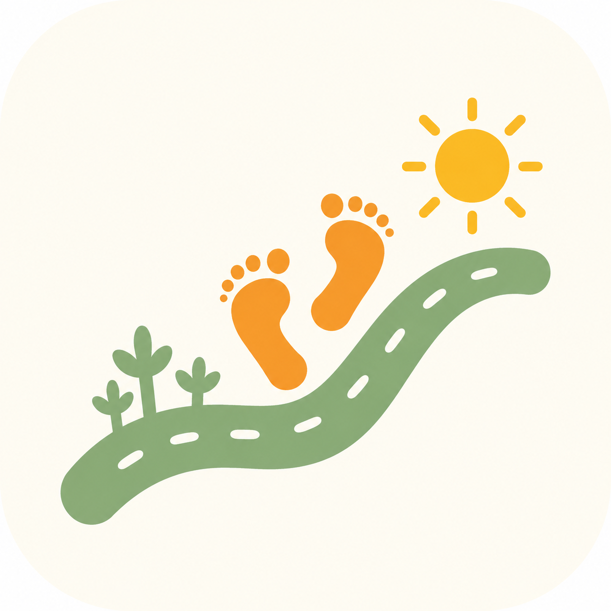

<div align="center">



# KidStep

**每一步，都陪你走**

A coaching tool for parents to help children transition smoothly from kindergarten to primary school.

[](https://nextjs.org/)
[](https://react.dev/)
[](https://www.typescriptlang.org/)
[](https://tailwindcss.com/)
[](https://www.prisma.io/)

[中文文档](./README_CN.md)

</div>

---

## Overview

KidStep is a lightweight coaching tool designed for parents of children entering primary school. Unlike course-based products, KidStep focuses on **daily habits, ability assessment, and parental guidance** to make the transition smooth and stress-free.

### Core Features

- **Ability Assessment** - 4 dimensions (Physical, Life, Social, Learning) with 40 questions
- **Training Plan** - 3-phase personalized task system with single-task mode
- **Check-in System** - Daily habit tracking with streak rewards
- **Knowledge Center** - Curated articles on kindergarten-primary transition
- **Growth Archive** - Milestone recording and progress visualization

### Design Principles

| Principle | Description |
|-----------|-------------|
| Single Task Mode | Show one task at a time to reduce cognitive load |
| Rewards Only | Never deduct points, always encourage |
| Parent as Designer | Parents customize plans based on their child's needs |
| Science-Based | Grounded in education research and new curriculum standards |

---

## Tech Stack

| Category | Technology |
|----------|------------|
| Framework | Next.js 14 (App Router) |
| UI | React 18, Tailwind CSS 3, shadcn/ui patterns |
| Database | SQLite (dev) / Supabase (prod) |
| ORM | Prisma |
| Auth | NextAuth v5 (Phone + SMS) |
| State | Zustand |
| Charts | Recharts |
| Icons | lucide-react |

---

## Getting Started

### Prerequisites

- Node.js 18+
- npm or yarn

### Installation

```bash
# Clone the repository
git clone https://github.com/your-username/kidstep.git
cd kidstep

# Install dependencies
npm install

# Setup environment
cp .env.example .env

# Initialize database
npm run db:push

# Start development server
npm run dev
```

Open [http://localhost:3000](http://localhost:3000) in your browser.

### Development Login

In development mode, any 6-digit code works for SMS verification:
1. Enter any 11-digit phone number
2. Enter any 6-digit code (e.g., `123456`)
3. Click login

---

## Project Structure

```
kidstep/
├── prisma/
│   └── schema.prisma          # Database schema
├── src/
│   ├── app/
│   │   ├── (auth)/            # Auth pages (login)
│   │   ├── (main)/            # Main app with TabBar
│   │   │   ├── home/          # Dashboard
│   │   │   ├── knowledge/     # Knowledge center
│   │   │   ├── assessment/    # Ability assessment
│   │   │   ├── plan/          # Training plan
│   │   │   └── profile/       # User profile
│   │   └── api/               # API routes
│   ├── components/
│   │   └── business/          # Business components
│   ├── lib/                   # Utilities
│   ├── stores/                # Zustand stores
│   ├── hooks/                 # Custom hooks
│   ├── contexts/              # React contexts
│   ├── types/                 # TypeScript types
│   └── constants/             # Constants (questions, tasks)
├── public/
│   └── images/brand/          # Brand assets
└── docs/                      # Documentation
```

---

## Available Scripts

```bash
npm run dev          # Start development server
npm run build        # Production build
npm run start        # Start production server
npm run lint         # Run ESLint

npm run db:push      # Push schema to database
npm run db:studio    # Open Prisma Studio
npm run db:seed      # Seed database
npm run db:migrate   # Create migration
```

---

## Features

### Assessment System
- 4 dimensions × 10 questions = 40 total
- Radar chart visualization
- Personalized suggestions based on scores

### Training Plan
- 3 phases aligned with school timeline
- Single-task mode for focused learning
- Points and streak rewards

### Knowledge Center
- Categorized articles
- Search functionality
- Favorites system

---

## Brand

| Item | Value |
|------|-------|
| Chinese Name | 童行 |
| English Name | KidStep |
| Slogan | 每一步，都陪你走 (Every step, with you) |
| Primary Color | #4CAF50 (Green) |
| Secondary Color | #FF9800 (Orange) |

---

## Documentation

- [Product Requirements](docs/PRD-产品需求文档.md)
- [Technical Design](docs/程序设计文档.md)
- [Component Interface](docs/组件接口设计.md)
- [Assessment Question Bank](docs/评估题库.md)
- [Task Template Library](docs/任务模板库.md)
- [Knowledge Article Outlines](docs/知识文章大纲.md)

---

## License

Private project. All rights reserved.
