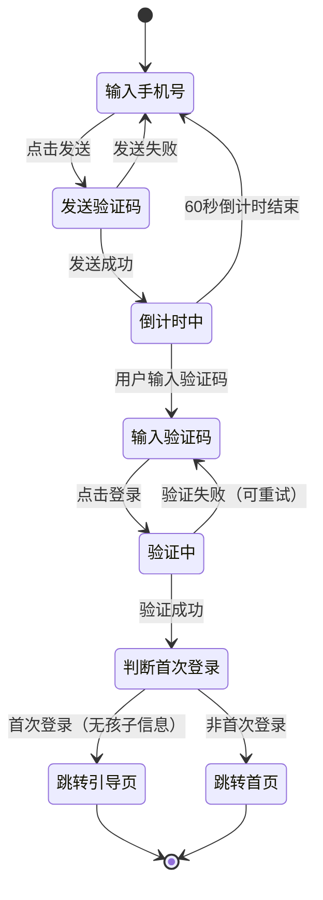
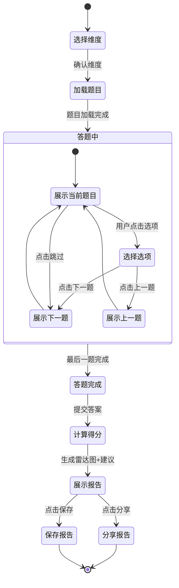
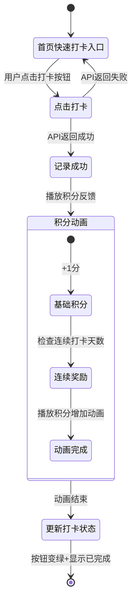
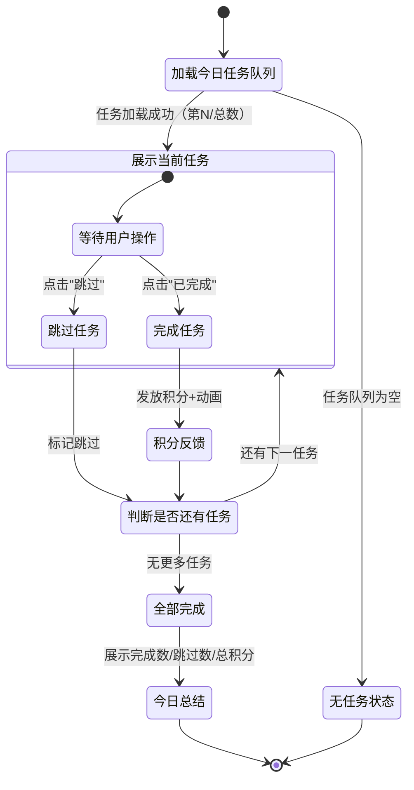

# 组件接口设计

> 版本：v1.0  
> 日期：2026-05-22  
> 作者：BeenLee

---

## Part 1: 核心流程状态图

### 1.1 登录流程



### 1.2 评估答题流程



### 1.3 打卡流程



### 1.4 单任务模式流程



---

## Part 2: 关键组件接口

### 2.1 通用类型定义

```typescript
/** 评估维度枚举 */
type Dimension = "PHYSICAL" | "LIFE" | "SOCIAL" | "LEARNING"

/** 任务类型枚举 */
type TaskType = "HABIT" | "ABILITY" | "BONDING" | "KNOWLEDGE"

/** 任务状态枚举 */
type TaskStatus = "PENDING" | "COMPLETED" | "SKIPPED"

/** 趋势方向 */
type Trend = "up" | "flat" | "down"

/** 成长记录类型 */
type MilestoneType = "TEXT" | "PHOTO" | "ASSESSMENT"

/** 文章分类 */
type ArticleCategory = "CONCEPT" | "CHECKLIST" | "SUBJECT" | "GUIDE" | "FAQ"

/** 选项键 */
type OptionKey = "A" | "B" | "C" | "D"
```

### 2.2 RadarChart - 能力雷达图

```typescript
/** 雷达图单维度数据 */
interface RadarDimensionData {
  /** 维度标识 */
  dimension: Dimension
  /** 维度显示名称（如"身心准备"） */
  label: string
  /** 得分（0-100） */
  score: number
  /** 满分，默认100 */
  fullMark: number
}

/** 雷达图Props */
interface RadarChartProps {
  /** 四维度分数数据 */
  data: RadarDimensionData[]
  /** 图表尺寸（宽高相等），单位px，默认200 */
  size?: number
  /** 是否显示维度标签文字 */
  showLabel?: boolean
  /** 点击某维度的回调 */
  onClick?: (dimension: Dimension) => void
}
```

### 2.3 CheckinButton - 快速打卡按钮

```typescript
/** 打卡按钮状态 */
type CheckinButtonStatus = "idle" | "loading" | "success" | "done"

/** 打卡按钮Props */
interface CheckinButtonProps {
  /** 打卡项名称（如"早起打卡"） */
  itemName: string
  /** 打卡类型 */
  type: TaskType
  /** 是否已打卡 */
  checked: boolean
  /** 打卡回调，返回Promise用于控制loading状态 */
  onCheckin: () => Promise<void>
  /** 是否处于加载中 */
  loading: boolean
}

/**
 * 打卡按钮内部状态流转：
 * idle → loading（用户点击） → success（API成功，播放动画） → done（动画结束，按钮变绿）
 * idle → loading → idle（API失败，恢复初始状态）
 */
```

### 2.4 TaskCard - 单任务卡片

```typescript
/** 任务数据 */
interface TaskData {
  /** 任务ID */
  id: string
  /** 任务标题 */
  title: string
  /** 任务描述 */
  description: string | null
  /** 任务类型 */
  taskType: TaskType
  /** 预计时长（分钟） */
  duration: number | null
  /** 任务状态 */
  status: TaskStatus
  /** 所属维度 */
  dimension: Dimension
}

/** 单任务卡片Props */
interface TaskCardProps {
  /** 任务数据 */
  task: TaskData
  /** 当前任务索引（从0开始） */
  index: number
  /** 任务总数 */
  total: number
  /** 完成任务回调 */
  onComplete: (taskId: string) => Promise<void>
  /** 跳过任务回调 */
  onSkip: (taskId: string) => Promise<void>
}
```

### 2.5 CalendarHeatmap - 打卡日历热力图

```typescript
/** 单日打卡数据 */
interface DayCheckinData {
  /** 日期（YYYY-MM-DD格式） */
  date: string
  /** 当日已完成打卡数 */
  completedCount: number
  /** 当日应完成打卡总数 */
  totalCount: number
}

/**
 * 颜色规则：
 * - 深绿 #4CAF50：completedCount === totalCount（全部完成）
 * - 浅绿 #C8E6C9：completedCount >= totalCount * 0.5（部分完成）
 * - 橙色 #FF9800：completedCount > 0 && completedCount < totalCount * 0.5（未完成）
 * - 灰色 #E0E0E0：completedCount === 0 且 totalCount > 0（未开始）
 * - 白色 #FFFFFF：totalCount === 0（无任务/休息日）
 */
type HeatmapColor = "#4CAF50" | "#C8E6C9" | "#FF9800" | "#E0E0E0" | "#FFFFFF"

/** 打卡日历热力图Props */
interface CalendarHeatmapProps {
  /** 日期→打卡数据映射，key为日期字符串YYYY-MM-DD */
  data: Record<string, DayCheckinData>
  /** 展示月份（YYYY-MM格式，如"2026-06"） */
  month: string
  /** 点击某日期的回调 */
  onDateClick?: (date: string, checkinData: DayCheckinData | null) => void
}
```

### 2.6 QuizQuestion - 评估答题组件

```typescript
/** 单个选项 */
interface QuizOption {
  /** 选项键 */
  key: OptionKey
  /** 选项文本 */
  text: string
  /** 该选项得分（0/1/3/5） */
  score: number
}

/** 题目数据 */
interface QuestionData {
  /** 题目ID */
  id: string
  /** 所属维度 */
  dimension: Dimension
  /** 子分类（如"运动能力"、"精细动作"） */
  category: string
  /** 题干 */
  question: string
  /** 选项列表（4个） */
  options: QuizOption[]
  /** 答题后显示的小贴士 */
  tips: string
  /** 关联知识文章标题 */
  relatedArticle?: string
}

/** 评估答题组件Props */
interface QuizQuestionProps {
  /** 题目数据 */
  question: QuestionData
  /** 当前题目索引（从0开始） */
  currentIndex: number
  /** 总题数 */
  totalCount: number
  /** 已选中的选项键，null表示未选 */
  selectedOption: OptionKey | null
  /** 选择选项回调 */
  onSelect: (optionKey: OptionKey) => void
  /** 是否显示答题贴士 */
  showTips: boolean
}
```

### 2.7 ArticleCard - 文章列表卡片

```typescript
/** 文章数据 */
interface ArticleData {
  /** 文章ID */
  id: string
  /** 文章分类 */
  category: ArticleCategory
  /** 文章标题 */
  title: string
  /** 文章摘要 */
  summary: string | null
  /** 封面图URL */
  coverUrl: string | null
  /** 标签列表 */
  tags: string[]
  /** 阅读量 */
  views: number
  /** 点赞数 */
  likes: number
  /** 发布时间（ISO字符串） */
  createdAt: string
}

/** 文章列表卡片Props */
interface ArticleCardProps {
  /** 文章数据 */
  article: ArticleData
  /** 是否已收藏 */
  isFavorited: boolean
  /** 收藏/取消收藏回调 */
  onFavoriteToggle: (articleId: string) => Promise<void>
  /** 点击卡片跳转回调 */
  onClick: (articleId: string) => void
}
```

### 2.8 ScoreCard - 分数展示卡片

```typescript
/** 分数展示卡片Props */
interface ScoreCardProps {
  /** 标签（如"身心准备"） */
  label: string
  /** 当前得分 */
  score: number
  /** 满分，默认100 */
  maxScore?: number
  /** 主题色（十六进制色值） */
  color: string
  /** 趋势：上升/持平/下降 */
  trend: Trend
}
```

### 2.9 PointsBadge - 积分徽章

```typescript
/** 积分徽章Props */
interface PointsBadgeProps {
  /** 当前积分数 */
  points: number
  /** 是否播放积分增加动画 */
  animate: boolean
}
```

### 2.10 TimelineItem - 成长时间轴

```typescript
/** 成长记录数据 */
interface MilestoneData {
  /** 记录ID */
  id: string
  /** 记录类型 */
  type: MilestoneType
  /** 文字内容 */
  content: string | null
  /** 媒体URL列表（图片等） */
  mediaUrls: string[]
  /** 创建时间（ISO字符串） */
  createdAt: string
}

/** 成长时间轴组件Props */
interface TimelineItemProps {
  /** 成长记录数据 */
  milestone: MilestoneData
  /** 删除记录回调 */
  onDelete: (milestoneId: string) => Promise<void>
}
```

### 2.11 ProgressRing - 环形进度条

```typescript
/** 环形进度条Props */
interface ProgressRingProps {
  /** 进度值（0-100） */
  progress: number
  /** 环形尺寸（直径），单位px，默认80 */
  size?: number
  /** 环形线宽，单位px，默认6 */
  strokeWidth?: number
  /** 进度条颜色（十六进制色值） */
  color: string
  /** 中心显示的文字标签（如"85%"） */
  label?: string
}
```

---

## Part 3: Zustand Store 接口

### 3.1 useChildStore - 当前选中孩子

```typescript
/** 孩子基本信息 */
interface ChildInfo {
  /** 孩子ID */
  id: string
  /** 孩子姓名 */
  name: string
  /** 生日（ISO日期字符串） */
  birthday: string
  /** 性别 */
  gender: "MALE" | "FEMALE" | "UNKNOWN"
  /** 目标学校 */
  targetSchool: string | null
}

/** 当前选中孩子Store */
interface ChildStore {
  /** 当前选中的孩子信息，null表示未选中 */
  currentChild: ChildInfo | null
  /** 用户的所有孩子列表 */
  children: ChildInfo[]
  /** 是否正在加载 */
  loading: boolean

  /** 设置当前选中孩子 */
  setCurrentChild: (child: ChildInfo) => void
  /** 加载孩子列表 */
  fetchChildren: () => Promise<void>
  /** 添加孩子 */
  addChild: (child: Omit<ChildInfo, "id">) => Promise<void>
  /** 更新孩子信息 */
  updateChild: (id: string, data: Partial<Omit<ChildInfo, "id">>) => Promise<void>
  /** 删除孩子 */
  removeChild: (id: string) => Promise<void>
  /** 重置状态（登出时调用） */
  reset: () => void
}
```

### 3.2 useTaskStore - 单任务模式队列状态机

```typescript
/** 任务队列状态机阶段 */
type TaskQueuePhase =
  | "idle"        // 初始状态
  | "loading"     // 加载任务队列中
  | "inProgress"  // 答题进行中
  | "completed"   // 全部完成

/** 今日任务汇总 */
interface TodaySummary {
  /** 完成任务数 */
  completedCount: number
  /** 跳过任务数 */
  skippedCount: number
  /** 总任务数 */
  totalCount: number
  /** 今日获得积分 */
  earnedPoints: number
}

/** 单任务模式队列Store */
interface TaskStore {
  /** 当前状态机阶段 */
  phase: TaskQueuePhase
  /** 今日任务队列 */
  queue: TaskData[]
  /** 当前展示的任务索引（从0开始） */
  currentIndex: number
  /** 当前任务（派生自queue和currentIndex） */
  currentTask: TaskData | null
  /** 是否全部完成 */
  allDone: boolean
  /** 今日汇总数据 */
  summary: TodaySummary

  /** 加载并初始化今日任务队列 */
  loadTodayTasks: (childId: string) => Promise<void>
  /** 完成当前任务并展示下一个 */
  completeAndNext: (taskId: string) => Promise<void>
  /** 跳过当前任务并展示下一个 */
  skipAndNext: (taskId: string) => Promise<void>
  /** 重置状态 */
  reset: () => void
}
```

### 3.3 useQuizStore - 评估答题状态

```typescript
/** 答题状态机阶段 */
type QuizPhase =
  | "idle"         // 初始（未开始）
  | "selectDimension"  // 选择评估维度
  | "loading"      // 加载题目中
  | "answering"    // 答题中
  | "submitting"   // 提交答案中
  | "report"       // 查看报告

/** 单题回答记录 */
interface QuizAnswer {
  /** 题目ID */
  questionId: string
  /** 选中的选项键 */
  optionKey: OptionKey
  /** 该选项对应得分 */
  score: number
}

/** 评估报告 */
interface AssessmentReport {
  /** 评估ID */
  id: string
  /** 评估维度 */
  dimension: Dimension
  /** 归一化总分（0-100） */
  score: number
  /** 优势项（得分最高的2-3个子分类） */
  strengths: string[]
  /** 薄弱项（得分最低的2-3个子分类） */
  weaknesses: string[]
  /** 个性化改进建议（3-5条） */
  suggestions: string[]
}

/** 评估答题Store */
interface QuizStore {
  /** 当前状态机阶段 */
  phase: QuizPhase
  /** 选中的评估维度 */
  selectedDimension: Dimension | null
  /** 当前题目列表 */
  questions: QuestionData[]
  /** 当前题目索引（从0开始） */
  currentIndex: number
  /** 所有答题记录 */
  answers: Record<string, QuizAnswer>
  /** 评估报告（提交后生成） */
  report: AssessmentReport | null
  /** 是否显示答题贴士 */
  showTips: boolean

  /** 选择评估维度并加载题目 */
  selectDimension: (dimension: Dimension) => Promise<void>
  /** 选择当前题目的选项 */
  selectOption: (questionId: string, optionKey: OptionKey, score: number) => void
  /** 跳转到下一题 */
  goNext: () => void
  /** 跳转到上一题 */
  goPrev: () => void
  /** 跳过当前题 */
  skipCurrent: () => void
  /** 切换贴士显示 */
  toggleTips: () => void
  /** 提交答案并生成报告 */
  submitAnswers: (childId: string) => Promise<void>
  /** 重置状态（重新开始评估） */
  reset: () => void
}
```

---

## Part 4: API 请求/响应类型

### 4.1 通用响应类型

```typescript
/** API成功响应 */
interface ApiSuccessResponse<T> {
  success: true
  data: T
}

/** API错误码枚举 */
type ApiErrorCode =
  | "VALIDATION_ERROR"      // 参数校验失败
  | "UNAUTHORIZED"          // 未登录
  | "FORBIDDEN"             // 无权限
  | "NOT_FOUND"             // 资源不存在
  | "RATE_LIMITED"          // 请求频率过高
  | "INTERNAL_ERROR"        // 服务器内部错误

/** API错误响应 */
interface ApiErrorResponse {
  success: false
  error: {
    code: ApiErrorCode
    message: string
  }
}

/** API统一响应类型 */
type ApiResponse<T> = ApiSuccessResponse<T> | ApiErrorResponse

/** 分页参数 */
interface PaginationParams {
  page: number
  pageSize: number
}

/** 分页响应 */
interface PaginatedData<T> {
  items: T[]
  total: number
  page: number
  pageSize: number
  totalPages: number
}
```

### 4.2 认证模块

```typescript
/** 发送验证码请求 */
interface SendSmsRequest {
  /** 手机号（11位） */
  phone: string
}

/** 发送验证码响应 */
interface SendSmsResponse {
  /** 是否发送成功 */
  sent: boolean
  /** 验证码过期时间（秒） */
  expiresIn: number
}

/** 登录请求（NextAuth CredentialsProvider） */
interface LoginCredentials {
  /** 手机号 */
  phone: string
  /** 6位验证码 */
  code: string
}

/** 会话用户信息 */
interface SessionUser {
  /** 用户ID */
  id: string
  /** 手机号 */
  phone: string
  /** 昵称 */
  nickname: string | null
  /** 头像URL */
  avatar: string | null
  /** 是否首次登录（无孩子信息） */
  isFirstLogin: boolean
}
```

### 4.3 孩子管理模块

```typescript
/** 添加孩子请求 */
interface CreateChildRequest {
  /** 孩子姓名 */
  name: string
  /** 生日（YYYY-MM-DD） */
  birthday: string
  /** 性别（可选） */
  gender?: "MALE" | "FEMALE" | "UNKNOWN"
  /** 目标学校（可选） */
  targetSchool?: string
}

/** 更新孩子请求 */
interface UpdateChildRequest {
  name?: string
  birthday?: string
  gender?: "MALE" | "FEMALE" | "UNKNOWN"
  targetSchool?: string | null
}

/** 孩子详情响应 */
interface ChildResponse {
  id: string
  name: string
  birthday: string
  gender: "MALE" | "FEMALE" | "UNKNOWN"
  targetSchool: string | null
  createdAt: string
  updatedAt: string
}
```

### 4.4 评估模块

```typescript
/** 提交评估请求 */
interface CreateAssessmentRequest {
  /** 孩子ID */
  childId: string
  /** 评估维度 */
  dimension: Dimension
  /** 答题记录 */
  answers: QuizAnswer[]
}

/** 评估详情响应 */
interface AssessmentResponse {
  id: string
  childId: string
  dimension: Dimension
  /** 归一化得分（0-100） */
  score: number
  /** 每题回答详情 */
  answers: QuizAnswer[]
  /** 评估报告 */
  report: {
    strengths: string[]
    weaknesses: string[]
    suggestions: string[]
  }
  createdAt: string
}

/** 获取评估历史查询参数 */
interface GetAssessmentsQuery {
  childId: string
}

/** 最新评估响应（可能为空） */
type LatestAssessmentResponse = AssessmentResponse | null
```

### 4.5 打卡模块

```typescript
/** 打卡请求 */
interface CreateCheckinRequest {
  /** 孩子ID */
  childId: string
  /** 打卡类型 */
  type: TaskType
  /** 打卡项名称 */
  itemName: string
  /** 备注（可选） */
  note?: string
}

/** 打卡响应（含积分） */
interface CheckinResponse {
  /** 打卡记录 */
  checkin: {
    id: string
    childId: string
    date: string
    type: TaskType
    itemName: string
    note: string | null
    createdAt: string
  }
  /** 获得的积分 */
  point: {
    id: string
    amount: number
    reason: string
  }
}

/** 月历数据查询参数 */
interface GetCalendarQuery {
  childId: string
  /** 月份（YYYY-MM格式） */
  month: string
}

/** 月历单日数据 */
interface CalendarDayResponse {
  /** 日期（YYYY-MM-DD） */
  date: string
  /** 已完成数 */
  completedCount: number
  /** 应完成总数 */
  totalCount: number
}

/** 打卡统计查询参数 */
interface GetCheckinStatsQuery {
  childId: string
}

/** 打卡统计响应 */
interface CheckinStatsResponse {
  /** 连续打卡天数 */
  streak: number
  /** 累计打卡天数 */
  totalDays: number
  /** 本月打卡率（0-1） */
  thisMonthRate: number
}

/** 今日打卡查询参数 */
interface GetTodayCheckinsQuery {
  childId: string
}
```

### 4.6 训练任务模块

```typescript
/** 今日任务查询参数 */
interface GetTodayTasksQuery {
  childId: string
}

/** 任务响应 */
interface TaskResponse {
  id: string
  childId: string
  phase: "PHASE_1" | "PHASE_2" | "PHASE_3"
  taskType: TaskType
  templateId: string
  title: string
  description: string | null
  /** 预计时长（分钟） */
  duration: number | null
  status: TaskStatus
  scheduledDate: string
  completedAt: string | null
  createdAt: string
}

/** 完成任务响应（含积分） */
interface CompleteTaskResponse {
  /** 更新后的任务 */
  task: TaskResponse
  /** 获得的积分 */
  point: {
    id: string
    amount: number
    reason: string
  }
}

/** 任务统计查询参数 */
interface GetTaskStatsQuery {
  childId: string
}

/** 任务统计响应 */
interface TaskStatsResponse {
  /** 已完成数 */
  completed: number
  /** 总数 */
  total: number
  /** 完成率（0-1） */
  rate: number
}
```

### 4.7 知识文章模块

```typescript
/** 文章列表查询参数 */
interface GetArticlesQuery {
  /** 分类筛选 */
  category?: ArticleCategory
  /** 页码 */
  page?: number
  /** 每页条数，默认10 */
  pageSize?: number
}

/** 文章列表响应 */
type ArticlesResponse = PaginatedData<ArticleData>

/** 文章搜索查询参数 */
interface SearchArticlesQuery {
  /** 搜索关键词 */
  q: string
}

/** 文章详情响应 */
interface ArticleDetailResponse {
  id: string
  category: ArticleCategory
  title: string
  /** Markdown正文内容 */
  content: string
  summary: string | null
  coverUrl: string | null
  tags: string[]
  views: number
  likes: number
  createdAt: string
  updatedAt: string
}
```

### 4.8 收藏模块

```typescript
/** 添加收藏请求 */
interface CreateFavoriteRequest {
  articleId: string
}

/** 收藏响应 */
interface FavoriteResponse {
  id: string
  userId: string
  articleId: string
  createdAt: string
  /** 关联的文章信息 */
  article: ArticleData
}
```

### 4.9 积分模块

```typescript
/** 积分查询参数 */
interface GetPointsQuery {
  childId: string
}

/** 积分来源 */
type PointSource = "CHECKIN" | "ASSESSMENT" | "MILESTONE" | "STREAK"

/** 积分记录 */
interface PointRecord {
  id: string
  amount: number
  reason: string
  source: PointSource
  createdAt: string
}

/** 积分总览响应 */
interface PointsResponse {
  /** 累计总积分 */
  total: number
  /** 积分历史记录 */
  history: PointRecord[]
}
```

### 4.10 成长档案模块

```typescript
/** 添加成长记录请求 */
interface CreateMilestoneRequest {
  childId: string
  type: MilestoneType
  /** 文字内容 */
  content?: string
  /** 图片URL数组 */
  mediaUrls?: string[]
}

/** 成长记录列表查询参数 */
interface GetMilestonesQuery {
  childId: string
}

/** 成长记录响应 */
interface MilestoneResponse {
  id: string
  childId: string
  type: MilestoneType
  content: string | null
  mediaUrls: string[]
  createdAt: string
}
```

---

_文档版本：v1.0_  
_最后更新：2026-05-22_
