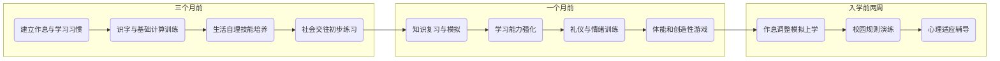

# 幼小衔接学习指导分析报告

## 执行摘要  
本报告围绕 **新课标下幼小衔接** 的理念和实践，从学科知识、能力培养到生活习惯等多维度进行系统梳理和指导建议。首先列举权威文件与研究成果作为依据；然后分别从语文、数学、英语、道德与社会/道德与法治、科学、艺术与体育六大学科角度，归纳一年级“必须掌握/建议掌握/可选拓展”的核心能力与知识点。接着给出**学习习惯与元认知能力**以及**生活自理与社会适应能力**的行为指标。报告为家长制定了 **3个月、1个月、入学前两周** 三个阶段的衔接训练方案，包含每日/每周练习建议、目标、所需材料、示例活动及评估方法，并配以流程图展示时间节点。还提供了**能力评估量表与记录表格**（家长观察表、能力评分表、入学准备总评表）。针对不同儿童基础，提出分层差异化建议与补救策略。最后推荐适龄读物、线上资源与教具，并强调避免过度训练、减轻压力、家校协同的重要性。全文引用了教育部课程标准、衔接指导意见等权威文件【7†L38-L43】【15†L59-L62】【25†L11-L16】【43†L33-L35】【35†L85-L89】。

## 权威来源及主要参考文献  
- **教育部新修订《义务教育课程方案和课程标准（2022年版）》**【7†L38-L43】【43†L33-L35】：强调九年一体化设计，注重幼小衔接，要求小学低年级课程“活动化、游戏化、生活化”设计【7†L38-L43】【43†L33-L35】。  
- **教育部《幼儿园与小学科学衔接指导意见（试行）》**【15†L59-L62】【15†L68-L70】：明确小学一年级上学期为入学适应期，倡导游戏化、生活化教学，坚决纠正超前教学【15†L59-L62】【15†L68-L70】。  
- **教育部《3～6岁儿童学习与发展指南》**（2012版）及**各省教育厅实施意见**：强调幼儿大班下学期开展入学准备教育，防止将小学内容简单搬到幼儿园。  
- **国家级学前教育与衔接研究**：如人民教育出版社语文教研成果【25†L11-L16】、教育研究机构与报刊解读文章【35†L85-L89】等，对低年级识字量、行为习惯培养、执行功能等进行了量化研究和建议。  
- **地方政策与实践案例**：各地教委政策（如湖南省实施办法【47†L77-L81】）和幼小衔接实验研究报告，阐明衔接教育目标、内容和方法。  

## 小学一年级学科核心能力与知识点（按“必须掌握/建议掌握/可选拓展”）  

- **语文：**  
  - **必须掌握：** 学习拼音声母、韵母、整体认读音节；认识拼音声调和简单拼读规则；认读约690个常用汉字，能书写约300个汉字【25†L11-L16】；能够正确朗读课文、简单段落；具备正确的读写习惯（握笔姿势、笔画书写顺序）；能完整表达一两个句子的意思并理解他人简单表达。【25†L11-L16】指出，新课标要求低年级认识常用汉字约1600个（一、二年级合计），其中一年级安排“认识汉字690个、会写300个”。  
  - **建议掌握：** 继续拓展识字量（可识300-400字并能运用）；积累常用词语、基础成语；能听懂并复述小故事、儿歌，尝试用通顺句子表达和描述简单事物；掌握基本的拼读技巧；学唱儿童歌曲、背诵古诗词3-5首（如《咏鹅》《静夜思》等）。  
  - **可选拓展：** 阅读适龄绘本与“桥梁书”以培养阅读兴趣；尝试写简单日记或短文（2-3句）；学习简单的书法笔画基本功，如楷书偏旁结构；接触童谣、顺口溜等传统口头文学。  

- **数学：**  
  - **必须掌握：** 能够正确写读数字1～100（按十个一组读写）；认识顺序与量的简单关系（大于、小于、多少）；掌握10以内的加减法口算，理解数的分解与合成（如理解“5＝2+3”）；认识基本的几何图形（正方形、长方形、三角形、圆形）；会比较长度、容量、重量的大小（简单用尺子或称重）；了解钟表上的整点概念；培养初步的数感和计数能力。  
  - **建议掌握：** 10以内连加、连减及简单的应用题；认识100的结构概念（如十几）；会画数轴初步表示数的位置；认识基本的方向（上、下、左、右、前、后）；了解简单的度量单位（厘米、分钟）；尝试分类、排序、简单规律推理。  
  - **可选拓展：** 100以内加减法；10以内乘除的启蒙（通过分组、平均分理解乘除概念）；掌握简单的时钟读法至半点；了解简单货币（1元、5元硬币）的认识与数额交换；动手制作简单数学游戏或拼图提高空间想象。  

- **英语（外语）：**  
  - **必须掌握：** 能够认读并正确书写26个英文字母（大写和小写）；掌握5～10个简单问候语（如：Hello, Goodbye, Thank you, How are you? 等）和自我介绍短语（My name is…）；认识基础数字1～10、常见颜色词（red, blue, green等）和身体部位词（eye, nose等）；能听懂并回应简单指令（Stand up, Sit down, Come here, etc.）；培养音标敏感度，尝试跟读简单单词。  
  - **建议掌握：** 扩展词汇量至50词左右（包含动物、食物、家庭成员等主题词汇）；会用英语表达简单需求（I want…, I like…, Where is…? 等）；初步接触简单儿歌、童谣并朗诵；能用拼读规则拼读简单的CVC单词；开始接触英语数字读法和基础礼貌用语。  
  - **可选拓展：** 阅读双语绘本或卡片拓展词汇；学习更多日常用语（如数字11-20，星期、月份）；初步理解英语书写方向、首字母大写规则；参加儿童英语角、观看英语动画片培养兴趣。  

- **品德与社会 / 道德与法治：**  
  - **必须掌握：** 尊重师长、尊敬父母，礼貌用语（请、谢谢、对不起等）；守规矩（遵守课堂纪律、礼让他人）；具备基本自律（自觉排队、不打断别人说话）；懂得分享和合作意识（愿意与同学合作游戏、分担小任务）；认识基本公共秩序（不随地乱扔垃圾、见到老人主动问好）；初步理解爱国、爱家、诚实、助人为乐等美德。  
  - **建议掌握：** 懂得简单的是非观念（什么行为是对的、什么是不好的，如看见同学跌倒应帮助）；了解国家象征（国旗、国徽）和小区/校园的规则（不在校园内随意奔跑、保护公物等）；培养集体荣誉感（班级活动积极参与），增强责任意识（如帮助老师分发课本）。  
  - **可选拓展：** 探讨多元文化（了解中国传统节日、节气）；识别并应对简单情绪（我生气时可以做深呼吸、找老师帮助）；认识家庭分工（帮助做家务）；学习基础法治意识（不打架、不偷拿他人东西）。  

- **科学：**  
  - **必须掌握：** 按新课标要求，科学课程从一年级起步【43†L33-L35】。培养观察身边事物的兴趣：认识自己身体的基本结构（五官、运动器官）、安全常识（火、刀具、电等危险标志）、常见动植物（花草、猫狗、昆虫等）；会提出问题并进行简单的观察或实验（如叶子浮沉、水溶解与否的试验）；了解简单的物质特性（冷热变化、固体液体状态）；培养自主探究能力。  
  - **建议掌握：** 了解自然现象（天气变化、四季特点）；认识基本的资源概念（如水、空气的珍贵）；能区分简单的材料（木头、金属、塑料）；进行观察记录（画图、圈圈）；亲自动手实验（简单的分类、配平等）。  
  - **可选拓展：** 学习磁铁、太阳、月亮等简单原理；植物生长观察（记录小植物的成长过程）；认识简单的机器原理（风车、滑轮模型）；通过动手制作玩具提高科学兴趣。  

- **艺术与体育：**  
  - **必须掌握：** **艺术（美术+音乐）**：能够使用常见画材（蜡笔、水彩笔）绘画，认识基本色彩（红、黄、蓝、绿等）和形状，学习用剪刀、安全地拼贴；能够跟随节奏挥动小乐器（铃鼓、口琴等）并大声唱童谣、儿歌；了解欣赏身边常见的艺术作品（画作、音乐片段）。  
    **体育与健康**：具有跑、跳、投、接等基本动作协调性；遵守体育课规则（听从老师指挥、按秩序排队）；学习简单的游戏规则和集体运动技巧（如踢毽子、跳绳、拍皮球）；养成讲卫生习惯（饭前便后洗手）和适当的运动习惯（每天户外活动30分钟）。  
  - **建议掌握：** 艺术方面鼓励舞蹈、戏剧元素（模仿动物叫声、做动作）；培养节奏感（拍手打节拍）和简单乐理（认识音符“do,re,mi”等）；体育方面掌握基本的平衡和柔韧动作（单脚站立、身体前屈），学习团队游戏（小游戏中分工合作）。  
  - **可选拓展：** 学习简单器乐（口风琴、乌克丽丽）；尝试手工制作简单艺品；了解其他运动项目（游泳、轮滑的安全知识）；培养独立运动兴趣（骑自行车）。  

## 学习习惯与元认知能力指标  
- **注意力**：能在家长监督下集中学习15-20分钟；上课时能安静听讲并做简单笔记；完成作业前会收拾好文具和工具。需要提高时，适当鼓励休息后继续【35†L50-L53】。  
- **作业习惯**：能按时完成作业，正确书写，边做边检查，出现错误主动思考修改；遇到不会的问题，先思考后询问，养成独立解决问题的意识；为减轻监督负担，家长可逐步减少“盯做”次数。  
- **时间管理**：能遵守作息时间，养成固定的作息表（起床、上学、课外活动、入睡）并尽量遵循；给孩子制定简单的每日计划（吃饭、写作业、游戏时间），培养时间观念；每完成一项任务后，自我评估是否按时完成。  
- **独立完成任务**：培养自己穿脱、收纳书包、独立梳洗等能力；遇到小挫折时给予适度鼓励，不急于代劳；家长可分解任务（如整理书桌可分步完成）并让孩子独立操作。  
- **口头与书面表达**：能用完整句子描述事物和经历，清晰表达需求；勇于在集体中回答问题，并尝试提问；写作时按词语顺序造句，正确标点并写自己的名字。  
- **合作与规则意识**：理解并遵守基本规则（排队、轮流、规则游戏）；与同伴能分享玩具、互助协作；能自我制止不良行为并提醒他人遵守；在竞争游戏中能遵守胜负规则并学会礼让【15†L59-L62】【35†L85-L89】。

以上各项可参考教育部关于学生执行功能和良好习惯培养的研究成果【35†L85-L89】【15†L59-L62】。比如神经科学指出，6～12岁是培养执行功能（注意力、记忆、控制力）的黄金期，过早超前学习反而损害这些能力【35†L85-L89】。

## 生活自理与社会适应能力  
- **独立生活技能**：能够自己穿脱衣物（包括扣纽扣、拉拉链）、系鞋带；独立进行如厕，知道完整的冲洗步骤；能使用餐具（筷子、勺子）正确取食，不浪费食物；按时吃饭、刷牙、洗澡，有简单的个人卫生习惯。  
- **环境适应能力**：对新环境不过度焦虑，能够按老师要求整理个人物品；遇到烦恼能用言语或画画表达，请求帮助。  
- **与同伴相处**：自觉遵守游戏规则，不随意干扰他人；在活动中主动轮流参与；能控制冲突情绪（不会随手打人或争抢玩具），愿意为和好解围。  
- **课堂规则意识**：进出教室先排队、举手上课、听到铃声知道课间或上课；能记住班级基本规章（如不喧哗、不随意乱写、课桌面上不用他人物品），并提醒同学共同遵守。  

## 家长衔接训练方案（分阶段实施）  
家长可以根据孩子实际情况，分为 **3个月前、1个月前、入学前两周** 三个阶段，逐步推进衔接训练。每阶段制定每日/每周目标和活动安排，融入游戏与生活情景中。

### 三个月前（按周计划）  
- **目标**：调整作息习惯、建立学习基础、培养兴趣与独立性。  
- **练习内容与方法**：  
  - **学习习惯**：每日固定练习写字、阅读时间。让孩子每日朗读1-2篇图画儿歌或短文，引导复述大意；做5-10道加减法口算题目（游戏形式进行），逐渐延长专注时间。可使用绘本、儿歌卡片等材料。  
  - **能力拓展**：每周学习10个汉字并能认读、抄写（目标690字，半途可为345字）；每周画一张自己喜欢的画并讲解；开展简单的科学实验（如倒水、比大小）培养观察力。  
  - **生活技能**：训练自己穿脱与整理背包，参与基本家务（铺床、倒水）。  
  - **社会技能**：参与集体活动（幼儿园班级或社区活动），培养规则意识（轮流、分享）。  
- **示例活动**：拼图游戏练习手眼协调；数字跳房子游戏巩固加减法；角色扮演课堂情景模拟，练习站立、举手、回答问题。  
- **评估方法**：家长每周填写简易记录表，记录识字量、自主作业完成情况、生活技能表现（参见评估表格模板）；根据进展适时调整难度。  

### 一个月前（按周计划）  
- **目标**：强化学科学习习惯、巩固学业知识、开展入学模拟。  
- **练习内容与方法**：  
  - **知识复习**：每天安排语文和数学复习（如识字10字、加减法复习）；练习简单英语对话（自我介绍、问候）；学习道路安全和卫生健康知识。使用同步练习册、教辅工具书。  
  - **学习能力**：模拟课堂环境训练，孩子连续学习20-30分钟，中间可安排短暂休息；练习写听写句子、口头表达一个题目的思路。培养计划执行能力，例如让孩子制定每日任务清单。  
  - **情绪与礼仪**：每天进行角色扮演游戏（如当老师、学生演示新生报到流程），鼓励孩子用“请、谢谢、对不起”等礼貌用语。教会正确表达紧张或愤怒，学习简单的情绪调节方法。  
  - **示例活动**：模拟小考试（几道选择题或填空题）培养考试心态；课余做亲子阅读，共同讨论故事内容。  
  - **评估方法**：每周末进行阶段测试（认读汉字、小学数学题目解答、英语听读），并与孩子一起反思问题所在。  

### 入学前两周（集中训练）  
- **目标**：调整作息、心理准备、熟悉校园规则。  
- **练习内容与方法**：  
  - **生活作息**：两周内坚持早睡早起，模拟上学时间，早饭后出门习惯。  
  - **心理预备**：通过参观小学、看“上学第一天”的绘本或动画，帮助孩子建立上学期待；进行“假装上学”游戏：孩子入教室写作业，家长扮演老师，引导正确举手发言。  
  - **规则演练**：练习排队、上厕所、报告错误等日常学校礼仪；让孩子独立整理书包、穿戴校服。  
  - **最后冲刺**：可以带着孩子去操场跑跑、踢踢球，释放精力；一起制定“入学日小目标”。  
  - **评估方法**：每天家长观察孩子情绪和行为变化，记录适应情况；最后两天进行心理辅导式谈话，解答孩子问题，缓解焦虑。  

上图为衔接训练大致流程：  

## 评估量表与记录表格模板  
1. **家长观察表**（按周填写）：列出关键观察项目（如作息时间、专注时长、情绪状态、合作行为等），家长每天标记情况（✔/✘或打分）。  
2. **能力评分表**：  
   | 能力项目       | 行为表现描述                           | 评分（1-5级） |
   |----------------|------------------------------------|-------------|
   | 生活自理       | 穿衣、如厕、用餐等独立完成情况           |             |
   | 专注力         | 完成任务所需时长；注意力持续程度         |             |
   | 学习能力       | 作业完整度、正确率；解决问题的主动性      |             |
   | 表达能力       | 口头回答完整性；写字正确性             |             |
   | 合作与守则意识 | 参与集体活动的配合度；遵守规则情况        |             |
3. **入学准备总评表**：对以上各项进行综合评价（优秀/良好/合格/需提高），记录孩子衔接准备总体情况，并给出改进建议。  

以上表格可供家长每日/每周记录并积累，从而系统了解孩子入学前后各项能力水平。

## 不同基础儿童的差异化建议与补救策略  
- **基础薄弱**：建议从兴趣入手，利用孩子喜欢的游戏或故事引导学习；例如用卡片游戏识字、用食物实际演示加减法。加强正反馈，勿频繁惩罚；建立完成简单任务的信心。适当延长准备周期，必要时寻求老师或辅导。减少超前内容，注重习惯和能力的稳步提升。  
- **基础中等**：可按照常规计划推进，并加入适度挑战（如稍多识字、增加思考题量）；注重巩固基础的同时，开始培养自主学习能力。例如让孩子自己制定小目标并监督执行。培养阅读兴趣，多进行亲子阅读讨论。  
- **基础优秀**：在保证掌握必修知识的前提下，增加趣味性拓展活动，如参与儿童数学竞赛、阅读百科知识；鼓励孩子自主提出问题并寻找答案。可加深科学和英语学习，例如参加趣味科学实验、英语故事分享会。同时，注意心理引导，避免孩子觉得学习枯燥或过于单一【35†L85-L89】。

## 书单与优质资源推荐  
- **书籍**：如《三字经》、《弟子规》等国学启蒙书（30-60分钟/日）；幼小衔接图书系列（桥梁书）如《神奇校车》（科学知识）或儿童文学经典（适合6-8岁桥梁书）；拼音识字绘本；《数学思维游戏》图书。推荐各类绘本、科普读物，结合孩子兴趣选取，阅读时长控制在15-20分钟。  
- **线上资源**：教育部的**国家中小学智慧教育平台**（1-6年级课程同步资源）【18†L125-L133】；**小学堂**、**学而思网校**等知名儿童教育平台中的免费体验课程；**学科网**、**雨课堂**等提供的趣味练习。建议每日在线学习不超过30分钟，总量控制在合理范围内。  
- **教具**：拼音卡片、数字卡片、积木、拼图、地球仪模型等实物教具；拼图、数学算盘、电子英语早教机等。**音乐与美术器材**：儿童画板、彩笔、儿童电子琴、音乐启蒙玩具；**体育用品**：跳绳、足球、儿童平衡车等。使用时间分阶段递增，每次训练15-30分钟，间或休息。推荐购买由专业教育机构或出版社推荐的系列教具（如“学前智力开发玩具”）。

## 风险与注意事项  
- **避免过度训练**：国家课程标准和研究指出，过早过度超前学习（如补数学竞赛）会给孩子带来压力，并损害认知发展【15†L59-L62】【35†L85-L89】。家长应保持理性，不以分数为唯一目标，重视学习兴趣和习惯培养。  
- **心理压力管理**：关注孩子的情绪变化，避免过度催促。入学适应应以激发好奇心和信心为主，而非惧怕与焦虑。家长要提供积极的情绪支持，与孩子平等沟通，及时缓解其紧张情绪【15†L68-L70】。  
- **家校沟通要点**：积极与幼儿园老师和小学教师沟通入学准备情况，了解学校要求和安排，避免信息不对称带来的不必要焦虑。让孩子知道家长与老师是一致的支持者，共同引导其适应小学生活。家长应宣传幼小衔接科学理念，避免盲目提前培训【15†L68-L70】【35†L85-L89】。  

以上方案汇集了当前教育部新课标精神和实践经验，为家长提供可操作的路径图。通过体系化的准备和科学的评估，可以有效降低幼小衔接的难度，帮助孩子快乐、自信地迈入小学。  

**参考资料：** 教育部课程标准及相关解读【7†L38-L43】【43†L33-L35】【15†L59-L62】【25†L11-L16】【35†L85-L89】（以上均为公开发行的权威来源）。